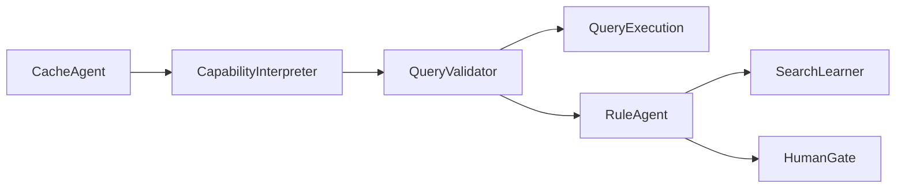

# FHIR Query Validator Factory

**Version:** 1.0  
**Date:** 2026-07-03

A spec-driven, production-grade **Generalized FHIR Query Validator** built with the [Squid Software Factory](https://github.com/iusztinpaul/squid) and [Grok Build](https://x.ai/cli). The system validates FHIR search queries against live `CapabilityStatement` metadata, executes valid queries, detects repeat failure patterns, escalates to human review when thresholds are met, and produces full audit trails.

This repository contains the complete implementation — not just specifications.

---

## Status

| Area | State |
|------|-------|
| Core agents | Implemented (Cache, CapabilityInterpreter, QueryValidator, QueryExecution, Rule, SearchLearner, HumanGate) |
| Workflow engine | Python-native (`src/agentic_layer/graph/workflow_engine.py`) |
| ADK entrypoint | Thin wrapper (`fhir_validator_agent/`) — see [ADR-002](docs/adr/002-python-native-workflow-adk-wrapper.md) |
| Tests | 197 passing; **≥99%** coverage on `src/agentic_layer` |
| CI | GitHub Actions — lint, format, tests, security scan |
| Demos | Public HAPI, mock.health, traceability, ADK |

---

## Quick Start

### Prerequisites

- Python 3.11+
- [uv](https://docs.astral.sh/uv/) package manager

### Install and test

```bash
git clone https://github.com/yogesh-parte/fhir-query-validator-squid-package.git
cd fhir-query-validator-squid-package

uv sync --group dev
make test
```

### Configure (optional)

For public servers (HAPI, Firely, etc.) no configuration is required. For authenticated servers:

```bash
cp .env.example .env.local
# Edit .env.local — see docs/configuration.md
```

### Run demos

```bash
make demo-loops          # Feedback loops against public HAPI server
make demo-agent-trace    # Per-agent trace + human pause/resume
make demo-mockhealth     # Authenticated mock.health demo (requires MOCK_HEALTH_API_KEY)
```

See [scripts/](scripts/) and [docs/public-test-servers.md](docs/public-test-servers.md) for details.

---

## Project Structure

```
fhir-query-validator-squid-package/
├── AGENTS.md                    # Agent conventions (source of truth for all agents)
├── specs/
│   └── fhir-query-validator-factory.md   # Master spec
├── docs/
│   ├── spec/                    # Per-agent specifications
│   ├── architecture.md
│   ├── traceability.md
│   ├── loop-engineering.md
│   ├── configuration.md
│   └── adr/                     # Architecture Decision Records
├── src/agentic_layer/           # Core implementation
│   ├── agents/                  # Specialist agents
│   ├── auth/                    # Bearer + OAuth2 providers
│   ├── config/                  # pydantic-settings + server registry
│   ├── graph/                   # Workflow engine + graph nodes
│   └── utils/                   # Audit log, query parser, URL safety
├── fhir_validator_agent/          # Google ADK root agent entrypoint
├── scripts/                     # Demo and operator scripts
├── tests/                       # Unit + integration tests
├── tasks/done/                  # Completed Squid implementation tasks (001–019)
├── pyproject.toml
├── Makefile
└── .github/workflows/ci.yml
```

---

## Development Commands

```bash
make install      # Install runtime + dev dependencies (uv sync)
make lint         # Ruff check
make test         # Full test suite with ≥99% coverage gate
make test-unit    # Unit tests only
make security     # Bandit SAST + pip-audit
make spec-check   # Verify all agent specs are present
make clean        # Remove caches and coverage artifacts
```

---

## Architecture

The workflow engine orchestrates specialist agents with explicit feedback loops:



- **Python-native engine** is the source of truth for orchestration and business logic.
- **ADK wrapper** delegates to the engine — no duplicated validation logic.
- **Human-in-the-loop** gates are configurable; high-severity queries escalate on first occurrence.
- **Traceability** — every agent decision is logged and exportable as JSON.

Full details: [docs/architecture.md](docs/architecture.md) · [docs/traceability.md](docs/traceability.md) · [docs/loop-engineering.md](docs/loop-engineering.md)

---

## Agent Specifications

| Spec | Agent |
|------|-------|
| [cache-agent-spec.md](docs/spec/cache-agent-spec.md) | CapabilityStatement caching + ETag/304 |
| [query-validation-spec.md](docs/spec/query-validation-spec.md) | Core query validation |
| [query-execution-spec.md](docs/spec/query-execution-spec.md) | Execute valid FHIR searches |
| [rule-and-learner-spec.md](docs/spec/rule-and-learner-spec.md) | Pattern detection, escalation, learning |
| [human-intervention-spec.md](docs/spec/human-intervention-spec.md) | Human gate + pause/resume |

Master spec: [specs/fhir-query-validator-factory.md](specs/fhir-query-validator-factory.md)

---

## Extending with Squid

This project was built via the Squid factory workflow. To add features or re-plan:

1. Update or add specs in `specs/` or `docs/spec/`.
2. Run `/squid-plan specs/fhir-query-validator-factory.md` in Grok Build.
3. Implement via `/squid-implement-task` or `/squid-implement-night`.
4. Ensure `make test` and `make security` pass before merge.

Squid plugin setup:

```bash
grok
/plugin marketplace add iusztinpaul/squid
/plugin install squid@iusztinpaul
```

All generated code must follow [AGENTS.md](AGENTS.md).

---

## References

- Original factory repo: [yogesh-parte/fhir-query-validator-factory](https://github.com/yogesh-parte/fhir-query-validator-factory)
- Squid: [iusztinpaul/squid](https://github.com/iusztinpaul/squid)
- Grok Build: [x.ai/cli](https://x.ai/cli)

---

*Maintained as part of ongoing work on practical, auditable multi-agent healthcare AI systems.*