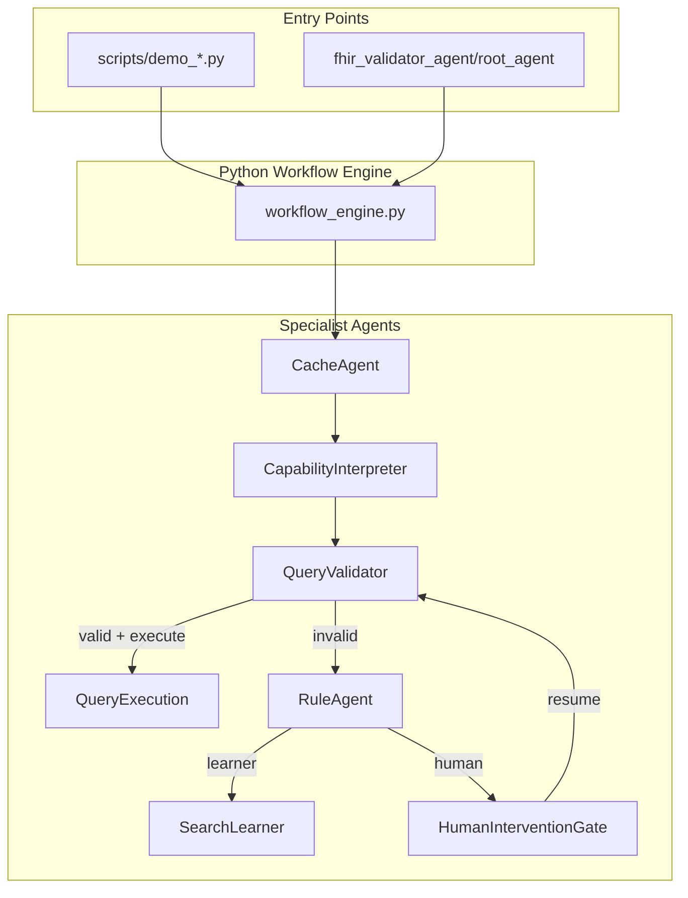

# ADR-002: Python-Native Workflow with Optional ADK Entrypoint

**Status:** Accepted  
**Date:** 2026-07-03  
**Related:** ADR-001, `specs/fhir-query-validator-factory.md`

## Context

The FHIR Query Validator Factory requires orchestration of six specialist agents with explicit feedback loops, human gates, and full auditability. ADR-001 adopted Google ADK as the primary platform. For the Squid greenfield re-implementation, we need a clear separation between **business logic** (testable, spec-driven) and **deployment adapters** (ADK CLI/Web).

## Decision

1. **Python-native workflow engine** (`src/agentic_layer/graph/workflow_engine.py`) is the source of truth for agent orchestration.
2. **Google ADK** (`fhir_validator_agent/`) is a thin wrapper that delegates to the workflow engine — no duplicated validation logic.
3. **In-memory cache only** for v1 (no Redis); auth-scoped cache keys prevent cross-tenant leakage.
4. **Rule-based Search Learner** for v1 — heuristic suggestions from CapabilityStatement + error patterns; no LLM dependency required.
5. **Escalation thresholds** configurable via `pydantic-settings` (`LEARNER_THRESHOLD_FAILURES=3`, `HUMAN_THRESHOLD_FAILURES=5`, etc.).
6. **Human gate** via console + JSON export for v1 demos; web UI deferred.

## Diagram

## Consequences

**Positive:**
- ≥99% test coverage achievable on pure Python modules without ADK runtime.
- Squid SWE/Tester agents can implement and verify each agent independently.
- ADK remains available for enterprise demos without coupling core logic to Google SDK.

**Negative:**
- Two entry paths to maintain (scripts + ADK wrapper).
- In-memory cache does not survive process restarts (acceptable for v1 demos).

## Alignment with Software Factory

Supports spec-driven development, specialist agents, explicit feedback loops, and mandatory human gates at escalation thresholds.