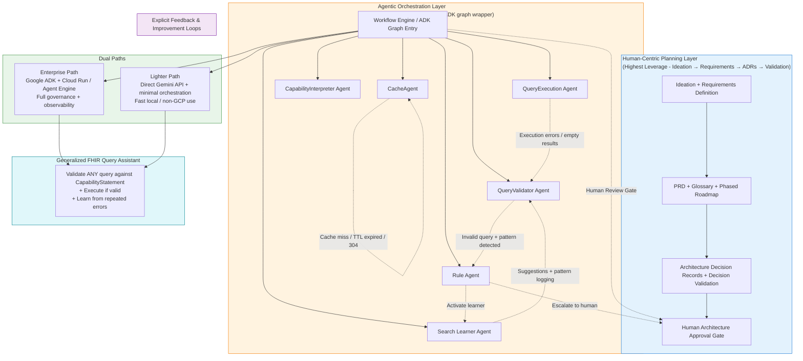

# Architecture

## High-Level Architecture

## Specialist Agents

| Agent                        | Responsibility                                      | Trigger |
|-----------------------------|-----------------------------------------------------|---------|
| CacheAgent                  | CapabilityStatement caching + invalidation          | Always |
| CapabilityInterpreter Agent | Dynamic interpretation of CapabilityStatement       | After Cache |
| QueryValidator Agent        | Validation + pattern detection                      | Core |
| QueryExecution Agent        | Execute FHIR search if valid                        | After validation pass |
| Rule Agent                  | Detect repeat invalid patterns & decide escalation  | On pattern |
| Search Learner Agent        | Explain mistakes & suggest improvements             | Triggered by Rule Agent |
| Human Intervention Gate     | Human review when needed                            | Triggered by Rule Agent |

## Key Design Principles
- Planning is human-centric and upstream
- Specialist agents over monolithic agents
- Explicit feedback loops
- Human gates at critical points
- Dual enterprise / lighter paths
